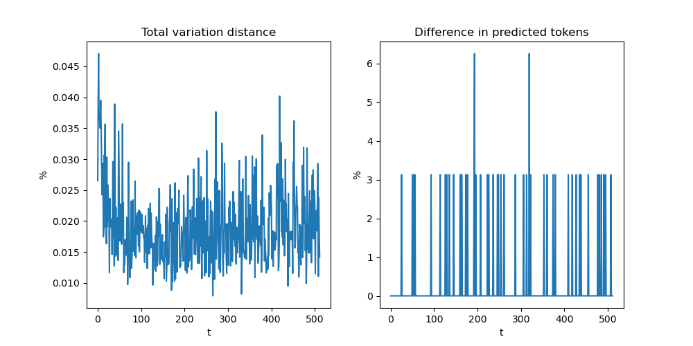
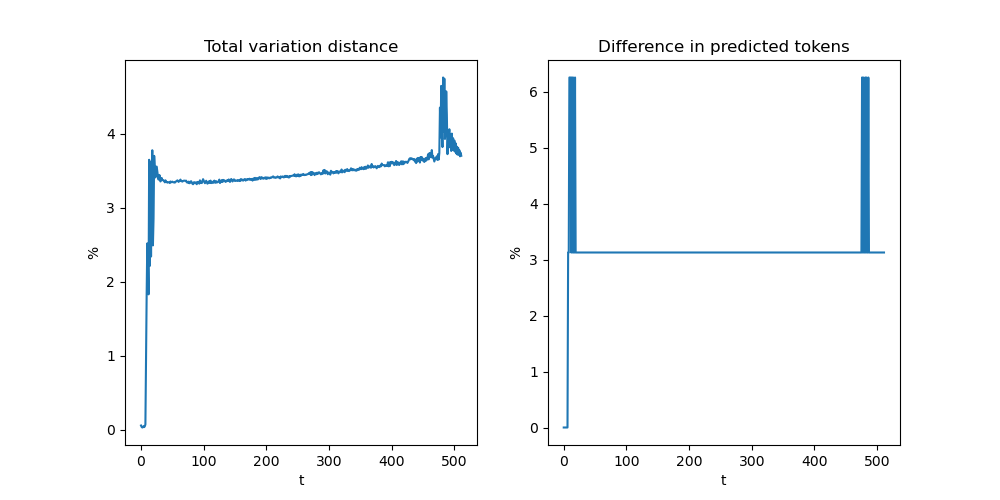
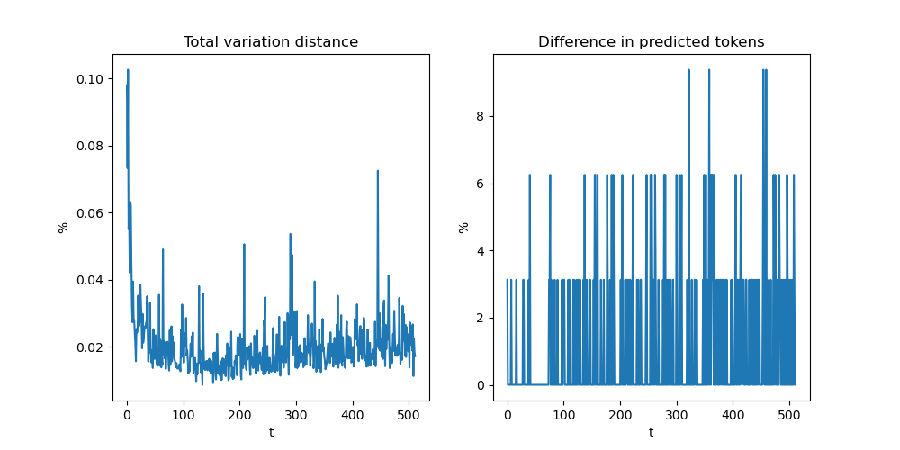
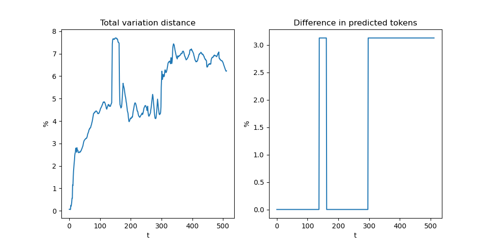

# Inference Speed Benchmark for Learning to (Learn at Test Time): RNNs with Expressive Hidden States

[**Paper**](https://arxiv.org/abs/2407.04620)
| [**JAX Codebase**](https://github.com/test-time-training/ttt-lm-jax)
| [**PyTorch Codebase**](https://github.com/test-time-training/ttt-lm-pytorch)
| [**Setup**](#setup)
| [**Quick Start**](#benchmark-usage)
| [**Limitations**](#limitations)
| [**Numerical Check**](#numerical-difference)

This codebase provides a fast implementation of **forward (prefill) and generate (decode)** for TTT-Linear and TTT-MLP, 
and the corresponding script that reproduces the throughput results in our paper.
This codebase **does not support training**, which includes backward in addition to forward. It is only a demonstration that TTT-Linear and TTT-MLP can be fast. It is not meant for real-world serving.

For training and replicating the perplexity results in our paper, please see our [JAX codebase](https://github.com/test-time-training/ttt-lm-jax).
For a simple tutorial with model definition in PyTorch, please see our [PyTorch codebase](https://github.com/test-time-training/ttt-lm-pytorch).

We use [ThunderKittens](https://github.com/HazyResearch/ThunderKittens) to kernelize forward (prefill), 
and [Triton](https://github.com/triton-lang/triton) to kernelize generate (decode).

## Setup

### C++/CUDA dependencies

**Install CUDA Toolkit 12.5.1**

Please follow [Nvidia's official guide](https://developer.nvidia.com/cuda-downloads).

For example, on Ubuntu 22.04.3 LTS (GNU/Linux 5.4.0-162-generic x86_64),
```
wget https://developer.download.nvidia.com/compute/cuda/12.5.1/local_installers/cuda_12.5.1_555.42.06_linux.run
sudo sh cuda_12.5.1_555.42.06_linux.run --toolkit --silent
```
Then check if `nvcc --version` says 12.5.

**Install gcc-13**
```
sudo apt update
sudo apt install -y software-properties-common
sudo add-apt-repository ppa:ubuntu-toolchain-r/test
sudo apt update
sudo apt install -y gcc-13 g++-13
sudo update-alternatives --install /usr/bin/gcc gcc /usr/bin/gcc-13 13 --slave /usr/bin/g++ g++ /usr/bin/g++-13
sudo update-alternatives --set gcc /usr/bin/gcc-13
```
Then check if `gcc --version` says 13.1.0.

### PyTorch dependencies

After C++/CUDA dependencies are installed, activate your conda virtual environment and run the below script:
```
bash setup_env.sh
```

## Benchmark Usage

```
bash benchmark_examples.sh
```

## Limitations

This codebase only benchmarks inference speed in a simulated setup that is standard to academic research, which follows that of [Mamba](https://github.com/state-spaces/mamba/blob/main/benchmarks/benchmark_generation_mamba_simple.py).
Limitations of our codebase:

1. Does not support training.

2. Does not support real-world model serving. Specifically, it
   * does not handles dynamic sequence batching and padding;
   * assumes all prompts in the batch are already padded to the same length, which is a multiple of the TTT mini-batch size 16;
   * uses random token indices as input and does not generate meaningful content.

3. Only benchmarks on a single A100 GPU in fp16 precision.

## Numerical Difference

Numerical difference is normal between any PyTorch implementation and its corresponding kernel, 
as the underlying computation libraries used by PyTorch cannot be easily controlled.

To verify that such numerical difference is within tolerance, we load the trained weights of a 1.3B model for both the PyTorch and kernelized implementation and compare their output probabilites. 
For prefill, both implementations use the same random input of shape `[B=32, T=512]`. 
For decode, both use the same random input of shape `[B=32, 1]` and generate `[B=32, T=512]`.

We denote the input token of the $i$-th sequence in the batch at the $t$-th time step as $x^i_t$, and its output probability by the PyTorch and kernelized implementation as $p(x^i_t)$ and $p^\prime(x^i_t)$, which both have shape `[Vocab,]` and sum up to 1.

We define two metrics for quantifying numerical difference and measure them at each time step $t$:

**Total variation distance (%)**:

$$ 
\frac{1}{B} \sum_{i=1}^{B} \max \|p(x^i_t) - p^\prime(x^i_t)\|.
$$

**Difference in predicted tokens (%)**:

$$ 
\frac{1}{B} \sum_{i=1}^{B}\mathbb{I}[\arg\max p(x^i_t) \neq \arg\max p^\prime(x^i_t)],
$$

where $\mathbb{I}$ is the indicator function.

As shown in the figures below, there is 3% different predicted tokens on average, 
which we believe is not unreasonable and can be further reduced given more dedicated efforts and hardware expertise.

### TTT-Linear
<table>
  <tr>
    <td><strong>Prefill</strong><br></td>
    <td><strong>Decode</strong><br></td>
  </tr>
</table>

### TTT-MLP
<table>
  <tr>
    <td><strong>Prefill</strong><br></td>
    <td><strong>Decode</strong><br></td>
  </tr>
</table>

